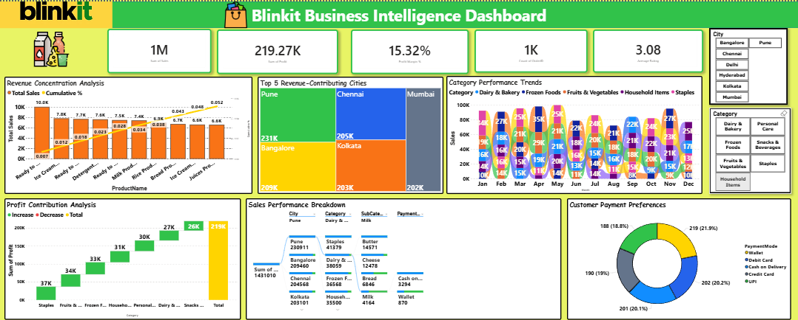

# 🛒 Blinkit Business Intelligence Dashboard
## 📌 Project Overview
The Blinkit Business Intelligence Dashboard is an interactive Power BI project developed to analyze Blinkit's retail sales performance, product distribution, customer purchasing behavior, and profitability. The dashboard consolidates multiple business metrics into a single analytical view, enabling stakeholders to monitor key performance indicators and make informed business decisions.
 
 ##📷 Dashboard Preview

## 🎯 Business Objectives

1. Analyze overall sales performance across products and cities.
2.Identify the highest revenue-generating products.
3.Compare profit contribution across product categories.
4. Evaluate city-wise sales performance.
5. Understand customer payment preferences.
6. Monitor monthly category-wise sales trends.
7. Support business decisions using interactive filtering.

## 📊 Key Performance Indicators

| KPI | Value |
| Total Sales | 1M |
| Total Profit | 219.27K |
| Profit Margin | 15.32% |
| Customer Count | 1K |
| Average Rating |3.08|

## 📈 Dashboard Features

 📌 Interactive KPI Cards
📍 City Filter
🛍️ Product Category Filter
📊 Revenue Concentration Analysis
🗺️ Top Revenue-Contributing Cities
 📈 Monthly Category Performance Trend
💰 Profit Contribution Analysis (Waterfall Chart)
📋 Sales Performance Breakdown Table
💳 Customer Payment Preference Analysis (Donut Chart)

## 🛠️ Tools & Technologies

1. Microsoft Power BI
2. Power Query
3. DAX

## 💼 Skills Demonstrated

1. Data Cleaning
2. Data Transformation
3. Data Modeling
4. DAX Measures
5. Dashboard Design
6.Business Intelligence
7. KPI Development
8. Interactive Reporting
9. Retail Sales Analytics
10. Data Visualization

## 💡 Key Business Insights

1. Achieved ₹1 Million in total sales with an overall profit of ₹219.27K.
2. Maintained a healthy 15.32% profit margin across product categories.
3.Pune emerged as the highest revenue-contributing city, followed closely by Chennai and Mumbai.
4. Ice Cream, Ready-to-Eat products, and Bakery items were among the strongest revenue contributors.
5. The Profit Contribution Analysis highlights which product categories drive profitability the most.
6. Monthly category trends reveal fluctuations in demand across different product groups throughout the year.
7.Customer payments are distributed across multiple payment modes, indicating diverse payment preferences.
8.Interactive filters allow users to analyze sales by city and product category for deeper business insights.

## 📂 Repository Contents

| File | Description |
| Blinkit_Sales_Dashboard.pbix | Power BI Dashboard |
| Dashboard.png | Dashboard Preview |
| Blinkit_Sales_Dashboard.pdf | Dashboard Report (PDF) |
| Blinkit_Sales_Dataset.xlsx | Source Dataset |

## 🚀 How to Use
1. Download the `.pbix` file.
2. Open it using Microsoft Power BI Desktop.
3. Explore the dashboard using the interactive filters and slicers.
4. Analyze KPIs, revenue trends, profit contribution, and customer payment behavior.

## 📌 Conclusion

This project demonstrates my ability to transform raw retail sales data into meaningful business insights using Power BI, Power Query, and DAX. Through interactive visualizations, KPI tracking, and business-focused analytics, the dashboard enables effective monitoring of sales performance, profitability, customer behavior, and regional trends, supporting data-driven decision-making.
